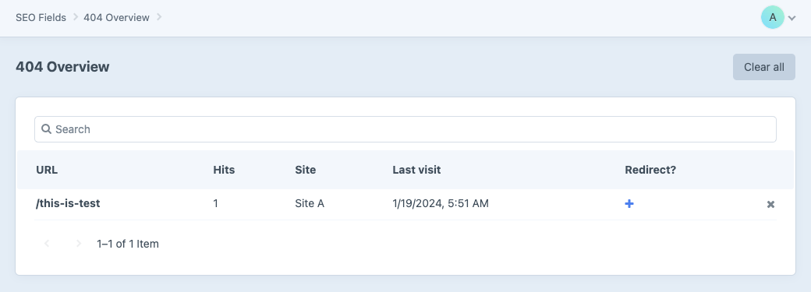

 
# 404 tracking

The plugin will keep track of visits and requests that resulted in a 404 (or "page not found") response.

These are tracked per site, with the number of times the specific url was visited (hits), when it was last visited - and show wether the "page not found" has a related redirect.

If there is no redirect linked to the url, you can create it from the overview by clicking the plus icon.

