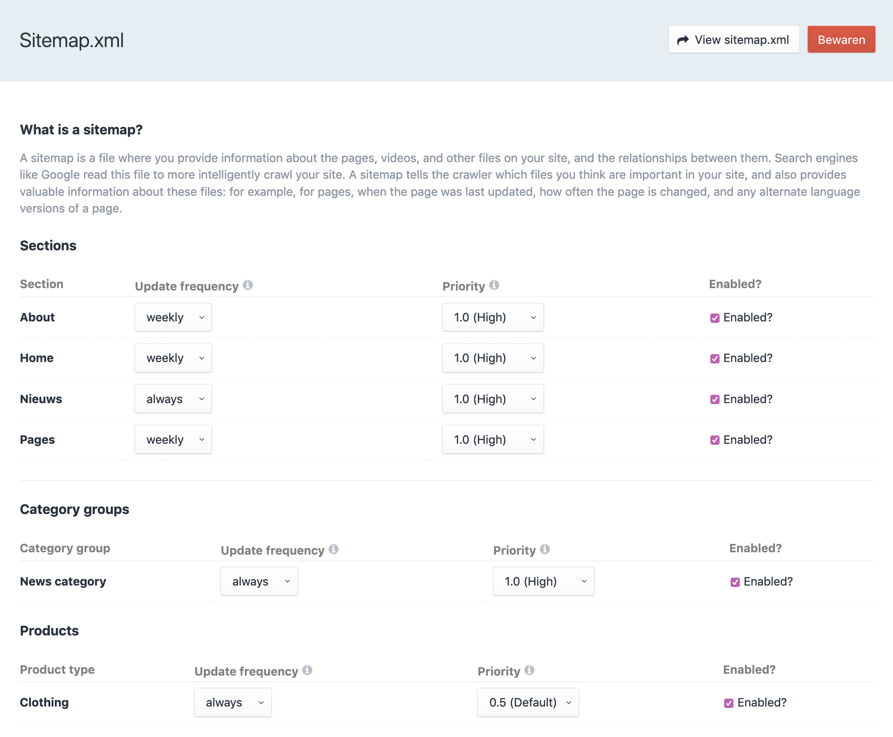

 
# Sitemap.xml

The sitemap includes support for Craft entries, categories and Commerce [Products](https://plugins.craftcms.com/commerce).

Support for custom urls and for registeren custom urls in code will be added in future release.

### Multisite

By default, each site in your Craft install will get the same sitemap.xml, depending on wether the sections you've enabled in the sitemap are enabled for that site and when the section has entries that are enabled for that site. If you need the option to change enable/disable section in the sitemap per site, you can add `sitemapPerSite => true` to config/seo-fields.php.

With that set, refresh the Sitemap settings page and you'll see a sites dropdown at the top so you can switch sites and save a sitemap for each.